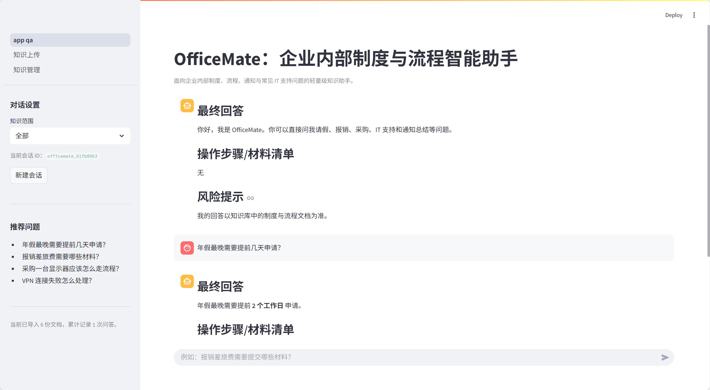
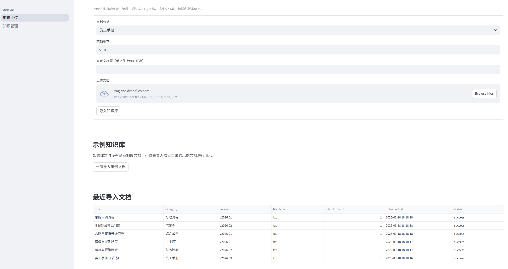
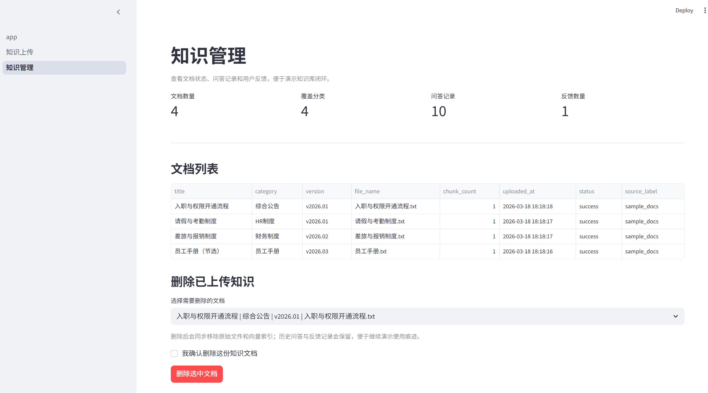

# OfficeMate

声明：本项目基础黑马程序员的rag案例进行改进而来，感谢黑马程序员分享。
OfficeMate 是一个基于 `Streamlit + LangChain + Chroma + DashScope` 搭建的企业内部制度与流程智能助手。  
它面向企业日常办公中的高频问题，帮助用户更方便地查询制度说明、梳理流程步骤、提取材料清单，并在回答中展示引用来源，尽量让每一条回答都更清楚、更可追溯。

整个项目保持了轻量、易理解的实现方式：

- 页面层使用 `Streamlit`
- 知识库检索使用 `LangChain + Chroma`
- 大模型能力使用 `DashScope`
- 文档元数据、问答日志、反馈记录使用本地 `JSON` 文件存储

如果你刚接触这类项目，也可以比较顺手地看懂整体结构，并完成本地演示。

## 项目定位

OfficeMate 主要解决企业内部常见的制度与流程查询问题，例如：

- 年假、病假、补卡、调休等 HR 相关制度
- 差旅、报销、发票、借款冲销等财务制度
- 采购申请、行政审批、办公用品申请等行政流程
- 密码重置、VPN 故障、软件安装、设备领用等 IT 支持问题
- 入职流程、权限开通、通知总结、FAQ 检索等综合办公场景


## 功能介绍

### 1. 智能问答

主页面保留了对话式交互体验，用户可以像聊天一样直接输入问题。

支持的问题类型包括：

- `制度问答`：例如“年假最晚需要提前几天申请？”
- `流程指引`：例如“采购一台显示器应该怎么走流程？”
- `材料清单`：例如“报销差旅费需要提交哪些材料？”
- `通知总结`：例如“请帮我概括一下这份通知的重点”

回答内容会尽量按照固定结构输出：

- `最终回答`
- `操作步骤/材料清单`
- `风险提示`
- `引用文档`

这样的输出方式比较适合演示，也方便后续写进简历或课程报告中。

### 2. 分类检索

为了避免知识库内容越来越多后出现“查得太散”的问题，项目支持按知识范围做分类过滤。

当前内置分类包括：

- 员工手册
- HR 制度
- 财务制度
- IT 支持
- 行政流程
- 综合公告

在聊天页左侧可以切换知识范围。  
当用户只想询问某一类文档时，可以先选定分类，再发起提问，这样检索结果会更聚焦。

### 3. 多格式文档上传

知识上传页支持将常见办公文档导入知识库，当前支持：

- `txt`
- `pdf`
- `docx`
- `xlsx`
- `csv`

上传时可以补充以下信息：

- 文档分类
- 文档版本
- 自定义标题

这些元数据会一并保存下来，后续在检索和管理页面中都可以看到。

### 4. 示例知识库

为了方便演示，项目自带了一组示例制度文档，覆盖了多个企业内部场景，例如：

- 员工手册
- 请假与考勤制度
- 差旅与报销制度
- 采购申请流程
- IT 服务台常见问题
- 入职与权限开通流程

如果暂时没有自己的企业文档，可以直接点击“一键导入示例文档”来体验完整流程。

### 5. 引用来源展示

回答并不是简单返回一段文本，而是会尽量附带引用来源，帮助用户了解答案来自哪份文档。

引用信息通常会展示：

- 文档标题
- 文档分类
- 文档版本
- 原始文件名

这样做的好处是：

- 方便核对答案是否有依据
- 降低“模型看起来像对，但其实无依据”的风险
- 让知识库问答更接近真实办公使用场景

### 6. 无依据时提示

如果系统没有在当前知识库中检索到足够材料，不会强行拼接答案，而是会明确提示“未找到明确依据”。

这部分设计虽然简单，但非常重要，因为它能提醒使用者：

- 当前问题超出了知识库覆盖范围
- 需要补充上传相关制度文档
- 在制度依据不充分时，不应直接执行流程

### 7. 本地 JSON 存储

考虑到项目面向入门学习和轻量演示，本项目没有引入数据库，而是使用本地 `JSON` 文件进行记录。

主要包括：

- `documents.json`：文档元数据
- `qa_logs.json`：问答日志
- `feedback_logs.json`：用户反馈

这样做的优点是：

- 不需要额外学习数据库
- 项目结构更清晰
- 本地运行和演示更方便

### 8. 知识管理页

知识管理页集中展示知识库运行情况，适合在答辩或项目介绍时展示“管理闭环”。

页面中可以查看：

- 当前文档数量
- 已覆盖分类数量
- 最近问答记录
- 用户反馈数量
- 文档列表与导入状态
- 删除已上传知识，并同步移除原始文件与向量索引

它虽然不是复杂后台，但已经能够体现一个完整 AI 应用的基础管理能力，也方便及时清理导错或过期的知识文档。

### 9. 用户反馈记录

在聊天页中，用户可以对回答进行简单反馈，例如：

- 有帮助
- 需改进

反馈会被记录下来，并在知识管理页中汇总显示。  

## 页面说明


### 1. 智能问答页

这张页面图展示的是 OfficeMate 的核心对话界面。

页面特点包括：

- 左侧提供知识范围筛选
- 显示当前会话 ID，方便区分不同对话
- 内置推荐问题，便于快速演示
- 中间区域展示完整问答记录
- 回答内容按“最终回答 / 操作步骤或材料清单 / 风险提示”结构输出


### 2. 知识上传页

这张页面图展示的是文档导入与知识库更新界面。

页面中可以完成：

- 选择文档分类
- 填写版本信息
- 补充自定义标题
- 上传本地文件
- 一键导入示例文档
- 查看最近导入文档列表


### 3. 知识管理页

这张页面图展示的是项目的轻量管理后台。

页面主要用于查看：

- 文档数量、分类数量、问答数量、反馈数量
- 当前知识库中的文档列表
- 最近问答记录
- 用户反馈记录
- 删除已上传知识，保持知识库内容可维护

## 项目结构

```text
OfficeMate/
├─ app.py                      # 主聊天页入口
├─ app_qa.py                   # 兼容旧入口，指向聊天页
├─ app_file_uploader.py        # 兼容旧入口，指向上传页
├─ pages/                      # Streamlit 多页面
├─ services/                   # 解析、存储、检索、问答、页面逻辑
├─ sample_docs/                # 示例制度文档
├─ storage/                    # 本地 JSON、原始文档、向量库
├─ config_data.py              # 配置项
└─ requirements.txt            # 依赖列表
```

## 运行方式

### 1. 安装依赖

```powershell
pip install -r requirements.txt
```

### 2. 配置 DashScope Key

```powershell
$env:DASHSCOPE_API_KEY="your_api_key"
```

### 3. 启动应用

推荐使用主入口：

```powershell
streamlit run app.py
```

如果你习惯之前的入口文件，也可以继续使用：

```powershell
streamlit run app_qa.py
streamlit run app_file_uploader.py
```


